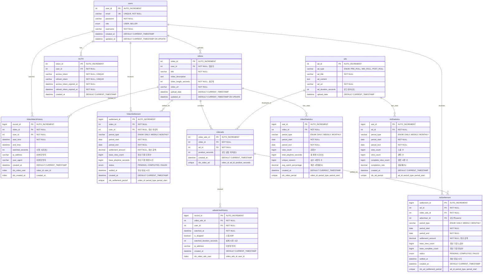

# 데이터베이스 ERD 설계 (Entity Relationship Diagram)

## 📋 개요

스트리밍 결제 정산 서비스의 데이터베이스 설계 문서입니다. MySQL과 Redis를 혼합하여 사용합니다.

### 데이터베이스 구성
- **MySQL**: 영구 데이터 저장 (사용자, 동영상, 광고, 정산, 통계)
- **Redis**: 임시 데이터 및 캐시 (어뷰징 방지, 실시간 집계)

---

## 🔗 전체 ERD (Mermaid)



---

## 🗄️ MySQL 테이블 설계

### 1. users (사용자)

**사용자 기본 정보를 관리하는 테이블**

| 컬럼명 | 데이터 타입 | 제약조건 | 기본값 | 설명 |
|--------|-------------|----------|--------|------|
| user_id | INT | PRIMARY KEY AUTO_INCREMENT | - | 사용자 식별자 |
| email | VARCHAR(255) | UNIQUE, NOT NULL | - | 이메일 (로그인 ID) |
| password | VARCHAR(255) | NOT NULL | - | 비밀번호 (암호화) |
| role | ENUM('USER', 'SELLER') | NOT NULL | 'USER' | 사용자 역할 |
| username | VARCHAR(255) | NOT NULL | - | 사용자 이름 |
| created_at | TIMESTAMP | NOT NULL | CURRENT_TIMESTAMP | 생성일시 |
| updated_at | TIMESTAMP | NOT NULL | CURRENT_TIMESTAMP ON UPDATE | 수정일시 |

#### DDL
```sql
CREATE TABLE users (
    user_id INT PRIMARY KEY AUTO_INCREMENT COMMENT '사용자 고유 식별자',
    email VARCHAR(255) UNIQUE NOT NULL COMMENT '이메일 (로그인 ID)',
    password VARCHAR(255) NOT NULL COMMENT '비밀번호 (BCrypt 암호화)',
    role ENUM('USER', 'SELLER') NOT NULL DEFAULT 'USER' COMMENT '사용자 역할 (일반/판매자)',
    username VARCHAR(255) NOT NULL COMMENT '사용자 닉네임',
    created_at TIMESTAMP DEFAULT CURRENT_TIMESTAMP COMMENT '계정 생성일시',
    updated_at TIMESTAMP DEFAULT CURRENT_TIMESTAMP ON UPDATE CURRENT_TIMESTAMP COMMENT '정보 수정일시'
) COMMENT '사용자 기본 정보 테이블';
```

#### 인덱스
```sql
CREATE INDEX idx_users_email ON users(email);
CREATE INDEX idx_users_created_at ON users(created_at);
```

---

### 2. AUTH (인증)

**JWT 토큰 관리 테이블**

| 컬럼명 | 데이터 타입 | 제약조건 | 기본값 | 설명 |
|--------|-------------|----------|--------|------|
| token_id | INT | PRIMARY KEY AUTO_INCREMENT | - | 토큰 ID |
| user_id | INT | NOT NULL, FK | - | 사용자 ID |
| access_token | VARCHAR(500) | UNIQUE, NOT NULL | - | Access Token |
| refresh_token | VARCHAR(500) | UNIQUE, NOT NULL | - | Refresh Token |
| access_token_expired_at | TIMESTAMP | NOT NULL | - | Access Token 만료시간 |
| refresh_token_expired_at | TIMESTAMP | NOT NULL | - | Refresh Token 만료시간 |
| created_at | TIMESTAMP | NOT NULL | CURRENT_TIMESTAMP | 토큰 발급일시 |

#### DDL
```sql
CREATE TABLE AUTH (
    token_id INT PRIMARY KEY AUTO_INCREMENT COMMENT '토큰 고유 식별자',
    user_id INT NOT NULL COMMENT '사용자 ID (외래키)',
    access_token VARCHAR(500) UNIQUE NOT NULL COMMENT 'JWT Access Token',
    refresh_token VARCHAR(500) UNIQUE NOT NULL COMMENT 'JWT Refresh Token',
    access_token_expired_at TIMESTAMP NOT NULL COMMENT 'Access Token 만료 시간',
    refresh_token_expired_at TIMESTAMP NOT NULL COMMENT 'Refresh Token 만료 시간',
    created_at TIMESTAMP DEFAULT CURRENT_TIMESTAMP COMMENT '토큰 발급일시',
    
    FOREIGN KEY (user_id) REFERENCES users(user_id) ON DELETE CASCADE
) COMMENT 'JWT 토큰 관리 테이블';
```

#### 인덱스
```sql
CREATE INDEX idx_auth_user_id ON AUTH(user_id);
CREATE INDEX idx_auth_access_token ON AUTH(access_token);
CREATE INDEX idx_auth_refresh_token ON AUTH(refresh_token);
```

---

### 3. videos (동영상)

**동영상 기본 정보를 관리하는 테이블**

| 컬럼명 | 데이터 타입 | 제약조건 | 기본값 | 설명 |
|--------|-------------|----------|--------|------|
| video_id | INT | PRIMARY KEY AUTO_INCREMENT | - | 동영상 ID |
| user_id | INT | NOT NULL, FK | - | 업로더 ID |
| title | VARCHAR(255) | NOT NULL | - | 동영상 제목 |
| video_description | TEXT | NULL | NULL | 동영상 설명 |
| video_length_seconds | INT | NOT NULL | - | 동영상 길이(초) |
| video_url | VARCHAR(500) | NOT NULL | - | 동영상 파일 URL |
| upload_date | TIMESTAMP | NOT NULL | CURRENT_TIMESTAMP | 업로드일시 |
| updated_at | TIMESTAMP | NOT NULL | CURRENT_TIMESTAMP ON UPDATE | 수정일시 |

#### DDL
```sql
CREATE TABLE videos (
    video_id INT PRIMARY KEY AUTO_INCREMENT COMMENT '동영상 고유 식별자',
    user_id INT NOT NULL COMMENT '업로더 사용자 ID (외래키)',
    title VARCHAR(255) NOT NULL COMMENT '동영상 제목',
    video_description TEXT NULL COMMENT '동영상 상세 설명',
    video_length_seconds INT NOT NULL COMMENT '동영상 총 길이 (초 단위)',
    video_url VARCHAR(500) NOT NULL COMMENT '동영상 스트리밍 URL',
    upload_date TIMESTAMP DEFAULT CURRENT_TIMESTAMP COMMENT '업로드 일시',
    updated_at TIMESTAMP DEFAULT CURRENT_TIMESTAMP ON UPDATE CURRENT_TIMESTAMP COMMENT '정보 수정일시',
    
    FOREIGN KEY (user_id) REFERENCES users(user_id) ON DELETE CASCADE,
    
    CONSTRAINT chk_video_length CHECK (video_length_seconds > 0)
) COMMENT '동영상 기본 정보 테이블';
```

#### 인덱스
```sql
CREATE INDEX idx_videos_user_id ON videos(user_id);
CREATE INDEX idx_videos_upload_date ON videos(upload_date);
CREATE INDEX idx_videos_title ON videos(title);
```

---

### 4. VideoWatchHistory (동영상 시청 기록)

**동영상 시청 이력을 관리하는 테이블 (어뷰징 방지 포함)**

| 컬럼명 | 데이터 타입 | 제약조건 | 기본값 | 설명 |
|--------|-------------|----------|--------|------|
| record_id | BIGINT | PRIMARY KEY AUTO_INCREMENT | - | 기록 ID |
| video_id | INT | NOT NULL, FK | - | 동영상 ID |
| user_id | INT | NOT NULL, FK | - | 시청자 ID |
| start_time | TIMESTAMP | NOT NULL | - | 시청 시작 시간 |
| end_time | TIMESTAMP | NULL | NULL | 시청 종료 시간 |
| watched_seconds | INT | NULL | NULL | 실제 시청 시간(초) |
| ip_address | VARCHAR(45) | NULL | NULL | 시청자 IP (어뷰징 방지) |
| user_agent | VARCHAR(500) | NULL | NULL | User Agent (어뷰징 방지) |
| created_at | TIMESTAMP | NOT NULL | CURRENT_TIMESTAMP | 기록 생성일시 |

#### DDL
```sql
CREATE TABLE VideoWatchHistory (
    record_id BIGINT PRIMARY KEY AUTO_INCREMENT COMMENT '시청 기록 고유 식별자',
    video_id INT NOT NULL COMMENT '시청한 동영상 ID (외래키)',
    user_id INT NOT NULL COMMENT '시청자 사용자 ID (외래키)',
    start_time TIMESTAMP NOT NULL COMMENT '시청 시작 시간',
    end_time TIMESTAMP NULL COMMENT '시청 종료 시간',
    watched_seconds INT NULL COMMENT '실제 시청한 시간 (초 단위)',
    ip_address VARCHAR(45) NULL COMMENT '시청자 IP 주소 (어뷰징 방지)',
    user_agent VARCHAR(500) NULL COMMENT '브라우저 User Agent (어뷰징 방지)',
    created_at TIMESTAMP DEFAULT CURRENT_TIMESTAMP COMMENT '기록 생성일시',
    
    FOREIGN KEY (video_id) REFERENCES videos(video_id) ON DELETE CASCADE,
    FOREIGN KEY (user_id) REFERENCES users(user_id) ON DELETE CASCADE,
    
    CONSTRAINT chk_watched_seconds CHECK (watched_seconds >= 0)
) COMMENT '동영상 시청 이력 및 어뷰징 방지 테이블';
```

#### 인덱스
```sql
CREATE INDEX idx_watch_video_user ON VideoWatchHistory(video_id, user_id);
CREATE INDEX idx_watch_created_at ON VideoWatchHistory(created_at);
CREATE INDEX idx_watch_user_created ON VideoWatchHistory(user_id, created_at);
CREATE INDEX idx_watch_ip_created ON VideoWatchHistory(ip_address, created_at);
```

---

### 5. ads (광고)

**광고 기본 정보를 관리하는 테이블**

| 컬럼명 | 데이터 타입 | 제약조건 | 기본값 | 설명 |
|--------|-------------|----------|--------|------|
| ad_id | INT | PRIMARY KEY AUTO_INCREMENT | - | 광고 ID |
| ad_type | ENUM | NOT NULL | - | 광고 유형 |
| ad_title | VARCHAR(255) | NOT NULL | - | 광고 제목 |
| ad_content | TEXT | NULL | NULL | 광고 내용 |
| ad_url | VARCHAR(500) | NOT NULL | - | 광고 소재 URL |
| ad_duration_seconds | INT | NOT NULL | - | 광고 길이(초) |
| upload_date | TIMESTAMP | NOT NULL | CURRENT_TIMESTAMP | 등록일시 |

#### Ad Type ENUM 값
- `PRE_ROLL`: 동영상 시작 전
- `MID_ROLL`: 동영상 중간
- `POST_ROLL`: 동영상 종료 후

#### DDL
```sql
CREATE TABLE ads (
    ad_id INT PRIMARY KEY AUTO_INCREMENT COMMENT '광고 고유 식별자',
    ad_type ENUM('PRE_ROLL', 'MID_ROLL', 'POST_ROLL') NOT NULL COMMENT '광고 삽입 유형',
    ad_title VARCHAR(255) NOT NULL COMMENT '광고 제목',
    ad_content TEXT NULL COMMENT '광고 상세 설명',
    ad_url VARCHAR(500) NOT NULL COMMENT '광고 소재 URL',
    ad_duration_seconds INT NOT NULL COMMENT '광고 길이 (초 단위)',
    upload_date TIMESTAMP DEFAULT CURRENT_TIMESTAMP COMMENT '광고 등록일시',
    
    CONSTRAINT chk_ad_duration CHECK (ad_duration_seconds > 0)
) COMMENT '광고 기본 정보 테이블';
```

#### 인덱스
```sql
CREATE INDEX idx_ads_type ON ads(ad_type);
CREATE INDEX idx_ads_upload_date ON ads(upload_date);
```

---

### 6. videoads (동영상-광고 매핑)

**동영상에 삽입된 광고 정보를 관리하는 테이블**

| 컬럼명 | 데이터 타입 | 제약조건 | 기본값 | 설명 |
|--------|-------------|----------|--------|------|
| video_ads_id | INT | PRIMARY KEY AUTO_INCREMENT | - | 매핑 ID |
| video_id | INT | NOT NULL, FK | - | 동영상 ID |
| ad_id | INT | NOT NULL, FK | - | 광고 ID |
| position_seconds | INT | NOT NULL | - | 광고 삽입 위치(초) |
| created_at | TIMESTAMP | NOT NULL | CURRENT_TIMESTAMP | 등록일시 |

#### DDL
```sql
CREATE TABLE videoads (
    video_ads_id INT PRIMARY KEY AUTO_INCREMENT COMMENT '동영상-광고 매핑 식별자',
    video_id INT NOT NULL COMMENT '동영상 ID (외래키)',
    ad_id INT NOT NULL COMMENT '광고 ID (외래키)',
    position_seconds INT NOT NULL COMMENT '광고 삽입 위치 (초 단위, 0은 PRE_ROLL)',
    created_at TIMESTAMP DEFAULT CURRENT_TIMESTAMP COMMENT '매핑 등록일시',
    
    FOREIGN KEY (video_id) REFERENCES videos(video_id) ON DELETE CASCADE,
    FOREIGN KEY (ad_id) REFERENCES ads(ad_id) ON DELETE CASCADE,
    
    UNIQUE KEY uk_video_ad_position (video_id, ad_id, position_seconds),
    CONSTRAINT chk_position CHECK (position_seconds >= 0)
) COMMENT '동영상별 광고 삽입 정보 테이블';
```

#### 인덱스
```sql
CREATE INDEX idx_videoads_video ON videoads(video_id);
CREATE INDEX idx_videoads_ad ON videoads(ad_id);
```

---

### 7. adwatchedHistory (광고 시청 기록)

**광고 시청 이력을 관리하는 테이블**

| 컬럼명 | 데이터 타입 | 제약조건 | 기본값 | 설명 |
|--------|-------------|----------|--------|------|
| record_id | BIGINT | PRIMARY KEY AUTO_INCREMENT | - | 기록 ID |
| video_ads_id | INT | NOT NULL, FK | - | 동영상-광고 매핑 ID |
| user_id | INT | NOT NULL, FK | - | 시청자 ID |
| watched_at | TIMESTAMP | NOT NULL | - | 시청 시간 |
| is_skipped | BOOLEAN | NOT NULL | FALSE | 스킵 여부 |
| watched_duration_seconds | INT | NULL | NULL | 실제 시청 시간(초) |
| ip_address | VARCHAR(45) | NULL | NULL | 시청자 IP (어뷰징 방지) |
| created_at | TIMESTAMP | NOT NULL | CURRENT_TIMESTAMP | 기록 생성일시 |

#### DDL
```sql
CREATE TABLE adwatchedHistory (
    record_id BIGINT PRIMARY KEY AUTO_INCREMENT COMMENT '광고 시청 기록 식별자',
    video_ads_id INT NOT NULL COMMENT '동영상-광고 매핑 ID (외래키)',
    user_id INT NOT NULL COMMENT '시청자 사용자 ID (외래키)',
    watched_at TIMESTAMP NOT NULL COMMENT '광고 시청 시간',
    is_skipped BOOLEAN NOT NULL DEFAULT FALSE COMMENT '광고 스킵 여부 (TRUE: 스킵함)',
    watched_duration_seconds INT NULL COMMENT '실제 시청한 광고 시간 (초 단위)',
    ip_address VARCHAR(45) NULL COMMENT '시청자 IP 주소 (어뷰징 방지)',
    created_at TIMESTAMP DEFAULT CURRENT_TIMESTAMP COMMENT '기록 생성일시',
    
    FOREIGN KEY (video_ads_id) REFERENCES videoads(video_ads_id) ON DELETE CASCADE,
    FOREIGN KEY (user_id) REFERENCES users(user_id) ON DELETE CASCADE,
    
    CONSTRAINT chk_ad_watched_duration CHECK (watched_duration_seconds >= 0)
) COMMENT '광고 시청 이력 및 완료 여부 테이블';
```

#### 인덱스
```sql
CREATE INDEX idx_adwatch_video_ads_user ON adwatchedHistory(video_ads_id, user_id);
CREATE INDEX idx_adwatch_created_at ON adwatchedHistory(created_at);
CREATE INDEX idx_adwatch_ip_created ON adwatchedHistory(ip_address, created_at);
```

---

### 8. VideoStatistics (동영상 통계)

**동영상 조회 및 시청 통계를 관리하는 테이블**

| 컬럼명 | 데이터 타입 | 제약조건 | 기본값 | 설명 |
|--------|-------------|----------|--------|------|
| stat_id | BIGINT | PRIMARY KEY AUTO_INCREMENT | - | 통계 ID |
| video_id | INT | NOT NULL, FK | - | 동영상 ID |
| period_type | ENUM | NOT NULL | - | 집계 기간 유형 |
| period_start | DATE | NOT NULL | - | 집계 시작일 |
| period_end | DATE | NOT NULL | - | 집계 종료일 |
| view_count | BIGINT | NOT NULL | 0 | 조회수 |
| total_playtime_seconds | BIGINT | NOT NULL | 0 | 총 재생시간(초) |
| unique_viewers | BIGINT | NOT NULL | 0 | 순수 시청자 수 |
| avg_watch_percentage | DECIMAL(5,2) | NULL | NULL | 평균 시청률(%) |
| created_at | TIMESTAMP | NOT NULL | CURRENT_TIMESTAMP | 통계 생성일시 |

#### Period Type ENUM 값
- `DAILY`: 일별 집계
- `WEEKLY`: 주별 집계
- `MONTHLY`: 월별 집계

#### DDL
```sql
CREATE TABLE VideoStatistics (
    stat_id BIGINT PRIMARY KEY AUTO_INCREMENT COMMENT '동영상 통계 식별자',
    video_id INT NOT NULL COMMENT '동영상 ID (외래키)',
    period_type ENUM('DAILY', 'WEEKLY', 'MONTHLY') NOT NULL COMMENT '집계 기간 유형',
    period_start DATE NOT NULL COMMENT '집계 시작 날짜',
    period_end DATE NOT NULL COMMENT '집계 종료 날짜',
    view_count BIGINT NOT NULL DEFAULT 0 COMMENT '총 조회수',
    total_playtime_seconds BIGINT NOT NULL DEFAULT 0 COMMENT '총 재생 시간 (초 단위)',
    unique_viewers BIGINT NOT NULL DEFAULT 0 COMMENT '순수 시청자 수 (중복 제거)',
    avg_watch_percentage DECIMAL(5,2) NULL COMMENT '평균 시청률 (완료율 %)',
    created_at TIMESTAMP DEFAULT CURRENT_TIMESTAMP COMMENT '통계 생성일시',
    
    FOREIGN KEY (video_id) REFERENCES videos(video_id) ON DELETE CASCADE,
    
    UNIQUE KEY uk_video_period (video_id, period_type, period_start),
    CONSTRAINT chk_period_dates CHECK (period_end >= period_start),
    CONSTRAINT chk_view_count CHECK (view_count >= 0),
    CONSTRAINT chk_avg_watch_percentage CHECK (avg_watch_percentage BETWEEN 0 AND 100)
) COMMENT '동영상별 조회 및 시청 통계 테이블';
```

#### 인덱스
```sql
CREATE INDEX idx_videostat_video_period ON VideoStatistics(video_id, period_type, period_start);
CREATE INDEX idx_videostat_created_at ON VideoStatistics(created_at);
```

---

### 9. AdStatistics (광고 통계)

**광고 노출 및 완료 통계를 관리하는 테이블**

| 컬럼명 | 데이터 타입 | 제약조건 | 기본값 | 설명 |
|--------|-------------|----------|--------|------|
| stat_id | BIGINT | PRIMARY KEY AUTO_INCREMENT | - | 통계 ID |
| ad_id | INT | NOT NULL, FK | - | 광고 ID |
| period_type | ENUM | NOT NULL | - | 집계 기간 유형 |
| period_start | DATE | NOT NULL | - | 집계 시작일 |
| period_end | DATE | NOT NULL | - | 집계 종료일 |
| view_count | BIGINT | NOT NULL | 0 | 노출 수 |
| click_count | BIGINT | NOT NULL | 0 | 클릭 수 |
| complete_view_count | BIGINT | NOT NULL | 0 | 완전 시청 수 |
| completion_rate | DECIMAL(5,2) | NULL | NULL | 완료율(%) |
| created_at | TIMESTAMP | NOT NULL | CURRENT_TIMESTAMP | 통계 생성일시 |

#### DDL
```sql
CREATE TABLE AdStatistics (
    stat_id BIGINT PRIMARY KEY AUTO_INCREMENT COMMENT '광고 통계 식별자',
    ad_id INT NOT NULL COMMENT '광고 ID (외래키)',
    period_type ENUM('DAILY', 'WEEKLY', 'MONTHLY') NOT NULL COMMENT '집계 기간 유형',
    period_start DATE NOT NULL COMMENT '집계 시작 날짜',
    period_end DATE NOT NULL COMMENT '집계 종료 날짜',
    view_count BIGINT NOT NULL DEFAULT 0 COMMENT '광고 노출 수',
    click_count BIGINT NOT NULL DEFAULT 0 COMMENT '광고 클릭 수',
    complete_view_count BIGINT NOT NULL DEFAULT 0 COMMENT '광고 완전 시청 수',
    completion_rate DECIMAL(5,2) NULL COMMENT '광고 완료율 (완전시청/노출 %)',
    created_at TIMESTAMP DEFAULT CURRENT_TIMESTAMP COMMENT '통계 생성일시',
    
    FOREIGN KEY (ad_id) REFERENCES ads(ad_id) ON DELETE CASCADE,
    
    UNIQUE KEY uk_ad_period (ad_id, period_type, period_start),
    CONSTRAINT chk_ad_period_dates CHECK (period_end >= period_start),
    CONSTRAINT chk_ad_counts CHECK (view_count >= complete_view_count),
    CONSTRAINT chk_completion_rate CHECK (completion_rate BETWEEN 0 AND 100)
) COMMENT '광고별 노출 및 완료 통계 테이블';
```

#### 인덱스
```sql
CREATE INDEX idx_adstat_ad_period ON AdStatistics(ad_id, period_type, period_start);
CREATE INDEX idx_adstat_created_at ON AdStatistics(created_at);
```

---

### 10. VideoSettlement (동영상 정산)

**동영상 수익 정산 정보를 관리하는 테이블**

| 컬럼명 | 데이터 타입 | 제약조건 | 기본값 | 설명 |
|--------|-------------|----------|--------|------|
| settlement_id | BIGINT | PRIMARY KEY AUTO_INCREMENT | - | 정산 ID |
| video_id | INT | NOT NULL, FK | - | 동영상 ID |
| user_id | INT | NOT NULL, FK | - | 정산 대상자 ID |
| period_type | ENUM | NOT NULL | - | 정산 기간 유형 |
| period_start | DATE | NOT NULL | - | 정산 시작일 |
| period_end | DATE | NOT NULL | - | 정산 종료일 |
| settlement_amount | DECIMAL(15,2) | NOT NULL | - | 정산 금액 |
| base_view_count | BIGINT | NOT NULL | - | 정산 기준 조회수 |
| base_playtime_seconds | BIGINT | NOT NULL | - | 정산 기준 재생시간 |
| status | ENUM | NOT NULL | 'PENDING' | 정산 상태 |
| settled_at | TIMESTAMP | NULL | NULL | 정산 완료 시각 |
| created_at | TIMESTAMP | NOT NULL | CURRENT_TIMESTAMP | 정산 생성일시 |

#### Status ENUM 값
- `PENDING`: 정산 대기
- `COMPLETED`: 정산 완료
- `FAILED`: 정산 실패

#### DDL
```sql
CREATE TABLE VideoSettlement (
    settlement_id BIGINT PRIMARY KEY AUTO_INCREMENT COMMENT '동영상 정산 식별자',
    video_id INT NOT NULL COMMENT '정산 대상 동영상 ID (외래키)',
    user_id INT NOT NULL COMMENT '정산 받을 사용자 ID (크리에이터)',
    period_type ENUM('DAILY', 'WEEKLY', 'MONTHLY') NOT NULL COMMENT '정산 주기 유형',
    period_start DATE NOT NULL COMMENT '정산 기간 시작일',
    period_end DATE NOT NULL COMMENT '정산 기간 종료일',
    settlement_amount DECIMAL(15,2) NOT NULL COMMENT '정산 금액 (원 단위)',
    base_view_count BIGINT NOT NULL COMMENT '정산 계산에 사용된 조회수',
    base_playtime_seconds BIGINT NOT NULL COMMENT '정산 계산에 사용된 총 재생시간 (초)',
    status ENUM('PENDING', 'COMPLETED', 'FAILED') NOT NULL DEFAULT 'PENDING' COMMENT '정산 처리 상태',
    settled_at TIMESTAMP NULL COMMENT '정산 처리 완료 시각',
    created_at TIMESTAMP DEFAULT CURRENT_TIMESTAMP COMMENT '정산 데이터 생성일시',
    
    FOREIGN KEY (video_id) REFERENCES videos(video_id) ON DELETE CASCADE,
    FOREIGN KEY (user_id) REFERENCES users(user_id) ON DELETE CASCADE,
    
    UNIQUE KEY uk_video_settlement_period (video_id, period_type, period_start),
    CONSTRAINT chk_settlement_amount CHECK (settlement_amount >= 0),
    CONSTRAINT chk_settlement_dates CHECK (period_end >= period_start)
) COMMENT '동영상 크리에이터 수익 정산 테이블';
```

#### 인덱스
```sql
CREATE INDEX idx_videosettlement_video ON VideoSettlement(video_id);
CREATE INDEX idx_videosettlement_user_status ON VideoSettlement(user_id, status);
CREATE INDEX idx_videosettlement_period ON VideoSettlement(period_type, period_start);
CREATE INDEX idx_videosettlement_status_created ON VideoSettlement(status, created_at);
```

---

### 11. AdSettlement (광고 정산)

**광고 수익 정산 정보를 관리하는 테이블**

| 컬럼명 | 데이터 타입 | 제약조건 | 기본값 | 설명 |
|--------|-------------|----------|--------|------|
| settlement_id | BIGINT | PRIMARY KEY AUTO_INCREMENT | - | 정산 ID |
| ad_id | INT | NOT NULL, FK | - | 광고 ID |
| video_ads_id | INT | NOT NULL, FK | - | 동영상-광고 매핑 ID |
| advertiser_id | INT | NOT NULL, FK | - | 광고주 ID |
| period_type | ENUM | NOT NULL | - | 정산 기간 유형 |
| period_start | DATE | NOT NULL | - | 정산 시작일 |
| period_end | DATE | NOT NULL | - | 정산 종료일 |
| settlement_amount | DECIMAL(15,2) | NOT NULL | - | 정산 금액 |
| base_view_count | BIGINT | NOT NULL | - | 정산 기준 노출수 |
| base_complete_count | BIGINT | NOT NULL | - | 정산 기준 완료수 |
| status | ENUM | NOT NULL | 'PENDING' | 정산 상태 |
| settled_at | TIMESTAMP | NULL | NULL | 정산 완료 시각 |
| created_at | TIMESTAMP | NOT NULL | CURRENT_TIMESTAMP | 정산 생성일시 |

#### DDL
```sql
CREATE TABLE AdSettlement (
    settlement_id BIGINT PRIMARY KEY AUTO_INCREMENT COMMENT '광고 정산 식별자',
    ad_id INT NOT NULL COMMENT '정산 대상 광고 ID (외래키)',
    video_ads_id INT NOT NULL COMMENT '동영상-광고 매핑 ID (외래키)',
    advertiser_id INT NOT NULL COMMENT '광고주 사용자 ID (외래키)',
    period_type ENUM('DAILY', 'WEEKLY', 'MONTHLY') NOT NULL COMMENT '정산 주기 유형',
    period_start DATE NOT NULL COMMENT '정산 기간 시작일',
    period_end DATE NOT NULL COMMENT '정산 기간 종료일',
    settlement_amount DECIMAL(15,2) NOT NULL COMMENT '정산 금액 (원 단위)',
    base_view_count BIGINT NOT NULL COMMENT '정산 계산에 사용된 노출수',
    base_complete_count BIGINT NOT NULL COMMENT '정산 계산에 사용된 완전 시청수',
    status ENUM('PENDING', 'COMPLETED', 'FAILED') NOT NULL DEFAULT 'PENDING' COMMENT '정산 처리 상태',
    settled_at TIMESTAMP NULL COMMENT '정산 처리 완료 시각',
    created_at TIMESTAMP DEFAULT CURRENT_TIMESTAMP COMMENT '정산 데이터 생성일시',
    
    FOREIGN KEY (ad_id) REFERENCES ads(ad_id) ON DELETE CASCADE,
    FOREIGN KEY (video_ads_id) REFERENCES videoads(video_ads_id) ON DELETE CASCADE,
    FOREIGN KEY (advertiser_id) REFERENCES users(user_id) ON DELETE CASCADE,
    
    UNIQUE KEY uk_ad_settlement_period (ad_id, period_type, period_start),
    CONSTRAINT chk_ad_settlement_amount CHECK (settlement_amount >= 0),
    CONSTRAINT chk_ad_settlement_dates CHECK (period_end >= period_start)
) COMMENT '광고 수익 정산 테이블';
```

#### 인덱스
```sql
CREATE INDEX idx_adsettlement_ad ON AdSettlement(ad_id);
CREATE INDEX idx_adsettlement_advertiser_status ON AdSettlement(advertiser_id, status);
CREATE INDEX idx_adsettlement_period ON AdSettlement(period_type, period_start);
CREATE INDEX idx_adsettlement_status_created ON AdSettlement(status, created_at);
```

---

## 🔴 Redis 데이터 구조

### 1. 어뷰징 방지 시스템

#### 동영상 중복 시청 체크 (Sorted Set)
```redis
# Key: abuse:video:{video_id}:{user_id}
# Score: timestamp (시청 시작 시간)
# Member: record_id

# 예시: user-123이 video-1을 시청한 기록 추가
ZADD "abuse:video:1:123" 1704067200 "record-1"
EXPIRE "abuse:video:1:123" 86400  # 24시간 후 만료

# 최근 24시간 내 시청 횟수 체크
ZCOUNT "abuse:video:1:123" "$(date -d '24 hours ago' +%s)" "+inf"
```

#### IP 기반 중복 시청 체크 (Set)
```redis
# Key: abuse:video:{video_id}:ip:{hashed_ip}
# Members: user_id들

# 예시: 같은 IP에서 여러 계정으로 시청 체크
SADD "abuse:video:1:ip:hash123" "user-123"
EXPIRE "abuse:video:1:ip:hash123" 3600  # 1시간 후 만료

# 해당 IP의 시청 계정 수 확인
SCARD "abuse:video:1:ip:hash123"
```

#### 광고 중복 시청 체크 (String)
```redis
# Key: abuse:ad:{video_ads_id}:{user_id}
# Value: watch count
# TTL: 86400초 (24시간)

# 예시: 광고 시청 기록
INCR "abuse:ad:100:user-123"
EXPIRE "abuse:ad:100:user-123" 86400

# 시청 횟수 조회
GET "abuse:ad:100:user-123"
```

---

### 2. 실시간 통계 집계 (빠른 조회용)

#### 동영상 실시간 조회수 (Hash)
```redis
# Key: stats:video:{video_id}:realtime
# Fields: view_count, playtime_seconds, unique_viewers

HINCRBY "stats:video:1:realtime" "view_count" 1
HINCRBY "stats:video:1:realtime" "playtime_seconds" 120
HINCRBY "stats:video:1:realtime" "unique_viewers" 1
EXPIRE "stats:video:1:realtime" 3600  # 1시간 후 만료 (배치에서 MySQL로 이관)
```

#### 광고 실시간 통계 (Hash)
```redis
# Key: stats:ad:{ad_id}:realtime
# Fields: view_count, complete_count, skip_count

HINCRBY "stats:ad:50:realtime" "view_count" 1
HINCRBY "stats:ad:50:realtime" "complete_count" 1
EXPIRE "stats:ad:50:realtime" 3600
```

#### 일별 Top 동영상 (Sorted Set)
```redis
# Key: stats:top:videos:daily:{date}
# Score: view_count
# Member: video_id

ZINCRBY "stats:top:videos:daily:2025-11-14" 1 "video-1"
EXPIRE "stats:top:videos:daily:2025-11-14" 604800  # 7일 후 만료

# Top 10 조회
ZREVRANGE "stats:top:videos:daily:2025-11-14" 0 9 WITHSCORES
```

---

### 3. 분산 락 (정산 처리용)

#### 정산 처리 락 (String)
```redis
# Key: lock:settlement:{settlement_type}:{period}
# Value: worker_id
# TTL: 300초 (5분, 정산 작업 타임아웃)

# 예시: 일별 동영상 정산 락 획득
SET "lock:settlement:video:daily:2025-11-14" "worker-1" EX 300 NX

# 락 해제
DEL "lock:settlement:video:daily:2025-11-14"
```

#### 통계 집계 락 (String)
```redis
# Key: lock:stats:{stats_type}:{period}
# Value: worker_id
# TTL: 180초 (3분)

SET "lock:stats:video:daily:2025-11-14" "worker-2" EX 180 NX
```

---

### 4. 캐시 데이터

#### 사용자 정보 캐시 (Hash)
```redis
# Key: cache:user:{user_id}
# Fields: email, username, role
# TTL: 600초 (10분)

HMSET "cache:user:123" "email" "user@example.com" "username" "홍길동" "role" "SELLER"
EXPIRE "cache:user:123" 600
```

#### 동영상 정보 캐시 (JSON String)
```redis
# Key: cache:video:{video_id}
# Value: JSON string
# TTL: 300초 (5분)

SET "cache:video:1" 
    "{\"videoId\":1,\"title\":\"강의영상\",\"length\":1200,\"uploaderName\":\"홍길동\"}" 
    EX 300
```

#### 인기 동영상 목록 캐시 (List)
```redis
# Key: cache:videos:popular
# Value: video_id 리스트 (순서대로)
# TTL: 600초 (10분)

LPUSH "cache:videos:popular" "video-5" "video-3" "video-1"
EXPIRE "cache:videos:popular" 600

# 인기 동영상 조회 (Top 10)
LRANGE "cache:videos:popular" 0 9
```

---

### 5. 세션 관리 (선택사항)

#### JWT 블랙리스트 (Set)
```redis
# Key: jwt:blacklist
# Members: 무효화된 access_token들
# TTL: token의 만료 시간까지

SADD "jwt:blacklist" "eyJhbGciOiJIUzI1NiIsInR5cCI6IkpXVCJ9..."
EXPIRE "jwt:blacklist" 3600  # access_token 만료시간

# 토큰 유효성 체크
SISMEMBER "jwt:blacklist" "eyJhbGciOiJIUzI1NiIsInR5cCI6IkpXVCJ9..."
```

---

## 🔗 테이블 관계 및 제약조건

### 외래키 관계
```
users (1) ←──────── (N) videos
users (1) ←──────── (N) VideoWatchHistory
users (1) ←──────── (N) adwatchedHistory
users (1) ←──────── (N) AUTH
users (1) ←──────── (N) VideoSettlement (크리에이터)
users (1) ←──────── (N) AdSettlement (광고주)

videos (1) ←─────── (N) VideoWatchHistory
videos (1) ←─────── (N) videoads
videos (1) ←─────── (N) VideoStatistics
videos (1) ←─────── (N) VideoSettlement

ads (1) ←────────── (N) videoads
ads (1) ←────────── (N) AdStatistics
ads (1) ←────────── (N) AdSettlement

videoads (1) ←───── (N) adwatchedHistory
videoads (1) ←───── (N) AdSettlement
```

### 비즈니스 제약조건

#### 1. 어뷰징 방지 규칙
- 동일 user_id + video_id 조합: 24시간 내 최대 3회 시청 인정
- 동일 IP + video_id 조합: 1시간 내 최대 5개 계정까지 인정
- 광고 시청: user_id + video_ads_id 조합 하루 1회만 정산 인정

#### 2. 통계 집계 규칙
- VideoStatistics: VideoWatchHistory 기반으로 일 1회 배치 집계
- AdStatistics: adwatchedHistory 기반으로 일 1회 배치 집계
- unique_viewers: user_id 기준 중복 제거

#### 3. 정산 규칙
- VideoSettlement.settlement_amount = (base_view_count × 단가) + (base_playtime_seconds × 단가)
- AdSettlement.settlement_amount = (base_complete_count × CPA)
- 정산은 DAILY(매일), WEEKLY(매주 월요일), MONTHLY(매월 1일) 실행

#### 4. 데이터 일관성
- VideoStatistics.view_count ≤ VideoWatchHistory의 해당 기간 레코드 수
- VideoSettlement.base_view_count = VideoStatistics.view_count (어뷰징 필터링 후)
- AdStatistics.complete_view_count ≤ AdStatistics.view_count

---

## 📊 성능 최적화

### 1. 인덱스 전략

#### 복합 인덱스
```sql
-- 동영상 시청 기록 조회 최적화 (사용자별, 기간별)
CREATE INDEX idx_watch_user_created ON VideoWatchHistory(user_id, created_at);

-- 광고 시청 기록 조회 최적화
CREATE INDEX idx_adwatch_video_ads_user ON adwatchedHistory(video_ads_id, user_id);

-- 정산 상태별 조회 최적화
CREATE INDEX idx_settlement_status_created ON VideoSettlement(status, created_at);
```

#### 커버링 인덱스
```sql
-- 동영상 목록 조회 시 제목, 업로더도 함께 조회
CREATE INDEX idx_videos_upload_title_user ON videos(upload_date DESC, title, user_id);

-- 통계 조회 시 주요 지표도 함께 조회
CREATE INDEX idx_videostat_video_period_views 
    ON VideoStatistics(video_id, period_type, period_start, view_count);
```

---

### 2. 파티셔닝 전략

#### 시간 기반 파티셔닝 (대용량 테이블)
```sql
-- VideoWatchHistory 월별 파티셔닝
ALTER TABLE VideoWatchHistory
PARTITION BY RANGE (YEAR(created_at) * 100 + MONTH(created_at)) (
    PARTITION p202511 VALUES LESS THAN (202512),
    PARTITION p202512 VALUES LESS THAN (202601),
    PARTITION p202601 VALUES LESS THAN (202602),
    PARTITION p202602 VALUES LESS THAN (202603)
);

-- adwatchedHistory 월별 파티셔닝
ALTER TABLE adwatchedHistory
PARTITION BY RANGE (YEAR(created_at) * 100 + MONTH(created_at)) (
    PARTITION p202511 VALUES LESS THAN (202512),
    PARTITION p202512 VALUES LESS THAN (202601)
);
```

---

### 3. Redis 최적화

#### 메모리 사용량 최적화
```redis
# Hash 구조로 메모리 절약 (어뷰징 체크)
HMSET "abuse:video:1:user:123" 
       "count" 2
       "last_watch" "1704067200"
       "ip_hash" "abc123"
EXPIRE "abuse:video:1:user:123" 86400

# Pipeline으로 배치 처리 (통계 업데이트)
PIPELINE
    HINCRBY "stats:video:1:realtime" "view_count" 1
    HINCRBY "stats:video:1:realtime" "playtime_seconds" 120
    ZADD "abuse:video:1:123" 1704067200 "record-1"
EXEC
```

#### Redis Cluster 구성 (확장성)
```
# 샤딩 전략
- abuse:* → Cluster Node 1-2 (어뷰징 방지)
- stats:* → Cluster Node 3-4 (실시간 통계)
- cache:* → Cluster Node 5-6 (캐시)
- lock:* → Cluster Node 7-8 (분산 락)
```

---

### 4. 쿼리 최적화

#### Batch Insert 사용
```sql
-- 통계 데이터 일괄 삽입 (Spring Batch에서 사용)
INSERT INTO VideoStatistics (video_id, period_type, period_start, period_end, view_count, total_playtime_seconds, unique_viewers)
VALUES 
    (1, 'DAILY', '2025-11-14', '2025-11-14', 1500, 180000, 1200),
    (2, 'DAILY', '2025-11-14', '2025-11-14', 2300, 276000, 1800),
    (3, 'DAILY', '2025-11-14', '2025-11-14', 890, 106800, 750)
ON DUPLICATE KEY UPDATE
    view_count = VALUES(view_count),
    total_playtime_seconds = VALUES(total_playtime_seconds),
    unique_viewers = VALUES(unique_viewers);
```

#### 읽기 전용 복제본 활용
```
Master: 쓰기 작업 (INSERT, UPDATE, DELETE)
Slave 1: 통계 조회 (SELECT from VideoStatistics, AdStatistics)
Slave 2: 시청 기록 조회 (SELECT from VideoWatchHistory, adwatchedHistory)
```

---

## 🔄 데이터 라이프사이클

### 1. 동영상 시청 플로우
```
1. 사용자 시청 시작
2. Redis 어뷰징 체크 (abuse:video:* 확인)
3. 통과 시 VideoWatchHistory INSERT
4. Redis 실시간 통계 업데이트 (stats:video:*:realtime)
5. 배치 작업으로 MySQL VideoStatistics 집계 (daily 1회)
6. 정산 작업으로 VideoSettlement 생성 (weekly/monthly)
```

### 2. 광고 시청 플로우
```
1. 사용자 광고 시청
2. Redis 어뷰징 체크 (abuse:ad:* 확인)
3. 통과 시 adwatchedHistory INSERT
4. Redis 실시간 통계 업데이트 (stats:ad:*:realtime)
5. 배치 작업으로 MySQL AdStatistics 집계
6. 정산 작업으로 AdSettlement 생성
```

### 3. 데이터 정리 작업

#### MySQL 스케줄러 (Old Data Archiving)
```sql
-- 1년 이상 된 시청 기록 아카이브 (매일 새벽 3시)
CREATE EVENT archive_old_watch_history
ON SCHEDULE EVERY 1 DAY
STARTS '2025-01-01 03:00:00'
DO
BEGIN
    -- 아카이브 테이블로 이동
    INSERT INTO VideoWatchHistory_archive
    SELECT * FROM VideoWatchHistory
    WHERE created_at < DATE_SUB(NOW(), INTERVAL 1 YEAR);
    
    -- 원본 테이블에서 삭제
    DELETE FROM VideoWatchHistory
    WHERE created_at < DATE_SUB(NOW(), INTERVAL 1 YEAR);
END;
```

#### Redis TTL 관리
```redis
# 어뷰징 방지 데이터: 24시간
EXPIRE "abuse:video:*" 86400

# 실시간 통계: 1시간 (배치 후 삭제)
EXPIRE "stats:*:realtime" 3600

# 분산 락: 5분 (타임아웃)
EXPIRE "lock:*" 300

# 캐시: 10분
EXPIRE "cache:*" 600
```

---

## 📈 모니터링 지표

### MySQL 모니터링
```sql
-- 테이블별 레코드 수
SELECT 
    table_name,
    table_rows,
    ROUND((data_length + index_length) / 1024 / 1024, 2) AS size_mb
FROM information_schema.tables
WHERE table_schema = 'streaming_db'
ORDER BY table_rows DESC;

-- Slow Query 확인
SELECT * FROM mysql.slow_log
WHERE query_time > 1
ORDER BY start_time DESC
LIMIT 10;
```

### Redis 모니터링
```redis
# 메모리 사용량
INFO memory

# Key 개수
DBSIZE

# 히트율 확인
INFO stats
```

---

## 📚 관련 문서

- [요구사항 명세서](./requirements.md)
- [API 명세서](./api-spec.md)
- [시퀀스 다이어그램](./sequence-diagrams.md)
- [시스템 아키텍처](./architecture.md)
- [Spring Batch 설계](./batch-design.md)